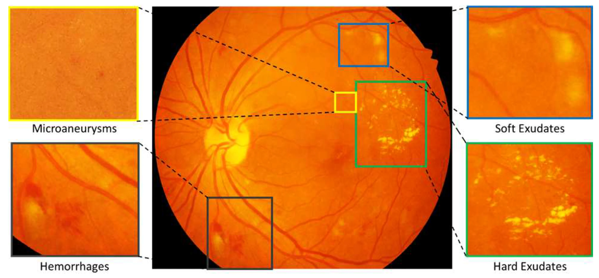

# Diabetic Retinopathy Severity Grading: A Comparative Study of Lightweight Architectures and Ordinal Regression

**Authors:** Carolina Bonafè, Lorenzo Girotti

**Course:** AI for Medicine - University of Bologna (Prof. Stefano Diciotti), Academic Year 2025/2026

[](https://github.com/lollogiro/ai4med-retinopathy/blob/main/scratch.ipynb)
[](https://github.com/lollogiro/ai4med-retinopathy/blob/main/EfficientNet.ipynb)

[](https://colab.research.google.com/github/lollogiro/ai4med-retinopathy/blob/main/scratch.ipynb)
[](https://colab.research.google.com/github/lollogiro/ai4med-retinopathy/blob/main/EfficientNet.ipynb)

---

> ⚠️ **Educational and Research Use Only**
> This project is provided strictly for educational and research purposes. The models are trained on public benchmark data and must not be used for clinical decision-making or diagnosis.

## Project Overview

Diabetic retinopathy (DR) is a microvascular complication of diabetes and a leading cause of preventable blindness in working-age adults. Its severity is graded on the ordinal International Clinical Diabetic Retinopathy (ICDR) scale (Wilkinson et al., 2003): 0 = no DR, 1 = mild NPDR, 2 = moderate NPDR, 3 = severe NPDR, 4 = proliferative DR. Grades 2-4 are referable and require specialist review, which makes automated severity grading a natural target for large-scale screening support.

This repository implements an end-to-end machine learning pipeline for **5-grade DR severity classification** on RetinaMNIST (MedMNIST v2, derived from DeepDRiD; Yang et al., 2023; Liu et al., 2022): 1,600 retinal fundus images (RGB, resized to 224×224), fixed splits of 1,080 train / 120 validation / 400 test, plus 5-fold stratified cross-validation on the training split. The classes are heavily imbalanced (~45% grade 0, ~6% grade 4), so macro F1, quadratic weighted kappa (QWK), and AUC are the primary metrics. The dataset provides no demographic metadata, so population representativeness cannot be assessed. Released under CC BY 4.0, not for clinical use.

Two design questions are explored:

1. Can a small CNN trained from scratch compete with a much larger ImageNet-pretrained network (EfficientNetV2-RW-T; Tan & Le, 2021) under linear probing and partial fine-tuning?
2. Does ordinal regression (CORAL; Cao et al., 2020) beat standard cross-entropy with class-balanced weights on an ordinal task?

<p align="center">
  
</p>
<p align="center">
  <em>Figure: Retina fundus image containing different retinal lesions associated with diabetic retinopathy. Porwal, P. et al. (2018)</em>
</p>

## Key Features

- **Data preprocessing** of retinal fundus images (Graham B., 2014: unsharp masking + circular mask, applied offline and cached; per-channel normalization computed on the training set only)
- **Data augmentation** (random flips, affine rotation/translation, color jitter)
- **Leakage control** (MD5 duplicate check across splits, fold-local class/importance weights, validation-only threshold tuning; no patient identifiers are available for patient-level separation)
- **Model training** with a custom **MicroSENet** (~1.7M parameters, trained from scratch: SE blocks, cross-layer feature fusion, head compression, dropout) and a pretrained **EfficientNetV2-RW-T** (12.6M parameters, linear probing / partial fine-tuning)
- **Ordinal regression** via CORAL heads with importance weights (Cao et al., 2020, Eq. 7) vs standard cross-entropy with class-balanced weights
- **Evaluation** with accuracy, macro F1, Quadratic Weighted Kappa (QWK), ROC AUC, and clinically motivated binary screening (sensitivity, specificity, PPV, NPV)
- **Explainability** via HiResCAM saliency maps

## Getting Started

Follow these steps to reproduce the project:

1. **Open the notebooks in Google Colab** (GPU recommended) using the badges above, or clone the repository and open them locally with Jupyter.

2. **Install dependencies** (first cells of each notebook):

   ```python
   !pip install medmnist==3.0.2 torchinfo==1.8.0 coral_pytorch==1.4.0 grad-cam==1.5.5
   ```

   `EfficientNet.ipynb` additionally installs `timm==1.0.28`. The same versions are pinned in `requirements.txt`:

   ```text
   medmnist=3.0.2
   torchinfo=1.8.0
   coral_pytorch=1.4.0
   grad-cam=1.5.5
   timm=1.0.28
   ```

3. **Run `scratch.ipynb` first**: it applies the offline Ben Graham preprocessing and caches the enhanced images as PNGs under `PREPROCESSED_DIR = "/content/preprocessed"` (a Colab path, change it when running locally). `EfficientNet.ipynb` expects the same preprocessed layout. RetinaMNIST is downloaded automatically by `medmnist` on first use.

4. **Reproducibility**: `SEED=42` throughout (`set_seed` per experiment, seeded DataLoader workers, deterministic algorithms). No checkpoints are saved, metrics and HiResCAM figures are printed inside the notebooks. Every number in this README comes from running the notebooks top-to-bottom.

## Repository Structure

```
├── scratch.ipynb                           # MicroSENet experiments
├── EfficientNet.ipynb                      # EfficientNetV2-RW-T experiments
├── requirements.txt                        # Pinned dependency versions
├── README.md                               # This file
├── assets                                  # Images used in the report
├── .gitignore                              # Ignore cache and venv files
└── AI_for_Medicine_Report_Bonafe_Girotti.pdf    # Project report
```

## Results

Test set metrics are reported for the final models trained on the full training set, while cross-validation metrics are reported as mean $\pm$ std across folds. Screening thresholds were tuned on the validation set (Sensitivity $\geq$ 0.95) and then applied to the test set.

### Cross-validation

_Table 1: 5-fold cross-validation, mean $\pm$ std._

| Model               | Config                     | Accuracy                | QWK                     | AUC                     |
| ------------------- | -------------------------- | ----------------------- | ----------------------- | ----------------------- |
| MicroSENet (~1.7M)  | CE                         | 0.5093 $\pm$ 0.0356     | **0.6727 $\pm$ 0.0265** | **0.8209 $\pm$ 0.0115** |
| MicroSENet (~1.7M)  | CORAL                      | **0.5102 $\pm$ 0.0269** | 0.6452 $\pm$ 0.0280     | 0.7475 $\pm$ 0.0160     |
| EfficientNetV2-RW-T | CE, linear probing         | 0.4241 $\pm$ 0.0451     | 0.5013 $\pm$ 0.0290     | 0.7142 $\pm$ 0.0298     |
| EfficientNetV2-RW-T | CORAL, linear probing      | 0.4685 $\pm$ 0.0153     | 0.6024 $\pm$ 0.0231     | 0.7291 $\pm$ 0.0139     |
| EfficientNetV2-RW-T | CE, partial fine-tuning    | 0.4722 $\pm$ 0.0343     | 0.5780 $\pm$ 0.0669     | 0.7785 $\pm$ 0.0268     |
| EfficientNetV2-RW-T | CORAL, partial fine-tuning | 0.5074 $\pm$ 0.0130     | 0.6559 $\pm$ 0.0135     | 0.7634 $\pm$ 0.0111     |

### Test set

_Table 2: Test set (n=400). Linear-probing variants were not evaluated on the test set._

| Model               | Params | Config                     | Accuracy   | AUC        | QWK        | Macro F1   |
| ------------------- | ------ | -------------------------- | ---------- | ---------- | ---------- | ---------- |
| MicroSENet          | ~1.7M  | CE                         | 0.4850     | **0.8459** | **0.7376** | 0.4323     |
| MicroSENet          | ~1.7M  | CORAL                      | 0.5125     | 0.7769     | 0.7110     | 0.3427     |
| EfficientNetV2-RW-T | 12.6M  | CE, partial fine-tuning    | **0.5200** | 0.7924     | 0.6749     | **0.4460** |
| EfficientNetV2-RW-T | 12.6M  | CORAL, partial fine-tuning | 0.4800     | 0.7557     | 0.6497     | 0.2854     |

The two MicroSENet heads differ markedly on rare classes: the CE model keeps sensitivity on minority grades (**Grade 1 Recall 0.630, Grade 4 Recall 0.700**), while the CORAL model's accuracy is driven by the majority class (Grade 0 Recall 0.851) at the cost of collapsing Grade 1 (**Recall 0.022, F1 0.030**). Overall, the from-scratch MicroSENet-CE achieves the best test **QWK (0.7376)** and **AUC (0.8459)** of all models despite ~7× fewer parameters. The pretrained EfficientNet CE partial fine-tuning version wins on accuracy (0.5200) and macro F1 (0.4460).

### Binary screening (non-referable = grades 0-1 | referable = grades 2-4)

_Table 3: Binary screening on the test set. The Se $\geq$ 0.95 threshold was tuned on the validation set and then applied to the test set._

| Model               | Config                     | Threshold (Se $\geq$ 0.95) | Sensitivity | Specificity | PPV       | NPV       |
| ------------------- | -------------------------- | --------------------- | ----------- | ----------- | --------- | --------- |
| MicroSENet          | CE                         | 0.173                 | **0.978**   | 0.514       | 0.622     | 0.966     |
| MicroSENet          | CORAL                      | 0.229                 | 0.978       | 0.609       | 0.672     | **0.971** |
| EfficientNetV2-RW-T | CE, partial fine-tuning    | 0.108                 | 0.967       | 0.259       | 0.516     | 0.905     |
| EfficientNetV2-RW-T | CORAL, partial fine-tuning | 0.252                 | 0.900       | **0.709**   | **0.717** | 0.897     |

Both MicroSENet heads reach 0.978 sensitivity for referable DR; the CORAL head is the more specific filter (Se 0.978 / Sp 0.609 / PPV 0.672 vs CE 0.978 / 0.514 / 0.622).

On EfficientNet, CE maximizes sensitivity (0.967) at the cost of low specificity (0.259); CORAL trades sensitivity for a much more balanced operating point with the best PPV (0.717).

## Ethics, Privacy, and Compliance

- **Dataset license and intended use.** RetinaMNIST is released under CC BY 4.0 for research and educational purposes. **This project is a research exercise, not a clinical tool**: the models must not be used for clinical decision-making or diagnosis.
- **Privacy.** RetinaMNIST contains no patient-identifiable information; it is a de-identified derivative of DeepDRiD (Liu et al., 2022). No external or private data was collected; all processing ran on public benchmark data in Google Colab.
- **Attribution.** CC BY 4.0 requires attribution to MedMNIST (Yang et al., 2023) and DeepDRiD (Liu et al., 2022).
- **Software licenses.** All dependencies are permissively licensed: `medmnist`, `timm` (Apache-2.0), `coral-pytorch`, `torchinfo`, `grad-cam` (MIT).
- **Explainability responsibility.** Interpretability was assessed qualitatively with HiResCAM because medical deployment demands plausible explanations; the reported thresholds are dataset-specific and would require recalibration on real screening populations.

## References

- Cao, W., Mirjalili, V., & Raschka, S. (2020). Rank consistent ordinal regression for neural networks with application to age estimation. _Pattern Recognition Letters, 140_, 325-331. https://arxiv.org/abs/1901.07884
- Graham, B. (2014). _Kaggle diabetic retinopathy detection competition_ (1st-place solution; unsharp masking and circular-mask preprocessing). https://www.kaggle.com/c/diabetic-retinopathy-detection/discussion/15801
- Liu, R., Wang, X., Wu, Q., Dai, L., Fang, X., Fei, T., et al. (2022). DeepDRiD: Diabetic retinopathy grading and image quality estimation challenge. _Patterns, 3_(6), 100512. https://doi.org/10.1016/j.patter.2022.100512
- Tan, M., & Le, Q. V. (2021). EfficientNetV2: Smaller models and faster training. _Proceedings of the 38th International Conference on Machine Learning (ICML)_. https://arxiv.org/abs/2104.00298
- Wilkinson, C. P., Ferris, F. L., Klein, R. E., Lee, P. P., Agardh, C. D., Davis, M., et al. (2003). Proposed international clinical diabetic retinopathy and diabetic macular edema disease severity scales. _Ophthalmology, 110_(9), 1677-1682.
- Yang, J., Shi, R., Wei, D., Liu, Z., Zhao, L., Ke, B., et al. (2023). MedMNIST v2: A large-scale lightweight benchmark for 2D and 3D biomedical image classification. _Scientific Data, 10_, 41. https://doi.org/10.1038/s41597-022-01721-8
- Porwal, P., Pachade, S., Kamble, R., Kokare, M., Deshmukh, G., Sahasrabuddhe, V., & Meriaudeau, F. (2018). Indian Diabetic Retinopathy Image Dataset (IDRiD): A Database for Diabetic Retinopathy Screening Research. Data, 3(3), 25. https://doi.org/10.3390/data3030025